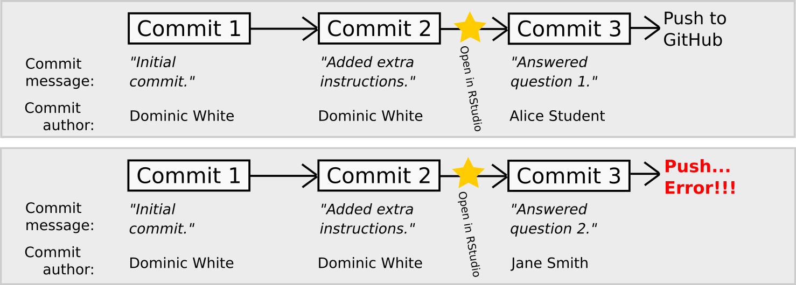
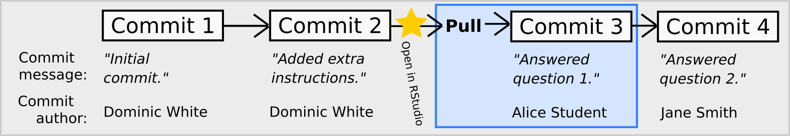

# Homework 1: The rail trail dataset

**Summary:** Your first major group assignment is a set of exercises based on a single dataset called `rail_trail`, which will provide you with practice in creating visualizations using R and `ggplot2`.

- [Homework 1: The rail trail dataset](#homework-1-the-rail-trail-dataset)
  - [Instructions](#instructions)
    - [Getting started](#getting-started)
    - [How to combine your answers into the group submission](#how-to-combine-your-answers-into-the-group-submission)
    - [Working with a GitHub repository as a group](#working-with-a-github-repository-as-a-group)
      - [Why can't I push my commit to GitHub?](#why-cant-i-push-my-commit-to-github)
      - [If the above advice doesn't work...](#if-the-above-advice-doesnt-work)
    - [Grading Criteria](#grading-criteria)
    - [Participation](#participation)
  - [How to submit](#how-to-submit)
    - [Fill out the `CONTRIBUTIONS.md` file](#fill-out-the-contributionsmd-file)
    - [Push all files and upload knitted PDF](#push-all-files-and-upload-knitted-pdf)
  - [The rail trail dataset](#the-rail-trail-dataset)
    - [How to describe your visualizations](#how-to-describe-your-visualizations)
    - [Questions](#questions)
  - [Cheatsheets](#cheatsheets)

## Instructions

### Getting started

This assignment contains 13 questions. Each member of the group will answer a subset of those questions.

The following is a checklist you may follow to help you get started with answering the questions as a group:

* [ ] Read through all the problems individually.
    Then, as a group, discuss what will be needed to fully answer each question (e.g. some questions depend on a previous question).

* [ ] Divide up the work among the group.
  * A typical way to do this is to have each group member be responsible for writing out the full answer to a certain number of questions.
  * Designate one person as the "editor" (responsible for combining everyone's work into the final document). The editor should answer slightly fewer questions than the other group members because of their extra editing responsibilities.

* [ ] **(Important)** Before you start, make a copy of `homework_1.Rmd` and **rename the copied file** to include your last name.
    For example, if your last name is Smith, then your file copy should be renamed to `homework_1_smith.Rmd`.

* [ ] Commit and push your copied file to GitHub (if you get an error, see the "Working with a GitHub repository as a group" section below).

* [ ] Write your contributions in **your** copy of the .Rmd file.
    For example, if my last name was Smith and I agreed to write-up the answers to questions 4, 5, and 6, then I would open up `homework_1_smith.Rmd` and put my answers there.
    When I'm done, I would save my file, then commit and push my work to GitHub.

### How to combine your answers into the group submission

While you will be writing your answers in separate files, eventually the group will need to merge in everyone's answers into the main `homework_1.Rmd` document. The following checklist may help with this:

* [ ] Select an editor to be in charge of merging everyone's answers into the final document `homework_1.Rmd`. Because the editor needs to prepare the document for submission, it is reasonable if he or she contributes slightly less in terms of answering the questions (for example, if everyone else answers three questions, it would be okay if the editor answers two).

* [ ] The editor should ensure that everyone has committed and pushed their answers to GitHub so they can copy and paste in each contribution.

* [ ] The editor needs to make sure that the final submission reads like a coherent document and that the writing style and code style are uniform across all the answers. In other words, it should read like a single person answered all the questions, not a group of four people.

* [ ] The editor will be in charge of of committing and pushing the final R Markdown file to GitHub, knitting to PDF, and uploading the PDF file on Blackboard.

* [ ] After everything is written up and ready for submission, the last thing the group will need to do is fill out the `CONTRIBUTIONS.md` file. See the section **[Fill out the `CONTRIBUTIONS.md` file](#fill-out-the-contributions.md-file)** for more details.

### Working with a GitHub repository as a group

You will likely encounter some issues while working in a group-based GitHub repository.

#### Why can't I push my commit to GitHub?

Every commit in Git is linked to the previous commit. This creates a history of commits that are chained together in a sequence. When you  click *"Push"* in the **Git** tab of RStudio, your latest additions to that chain are uploaded to GitHub. This allows everyone collaborating on a project to share the same history of commits.

However...

What happens if Alice and Jane both import the same project into their respective RStudio accounts and start working separately?

When they each commit their own work, they add a *different* final commit to that historical sequence. Alternate histories! Break out the Delorian, Marty...


Sadly, reality is more problematic. How can we possibly have different histories of changes in a single project, and how can we combine them into one?

If Alice commits her work and pushes to GitHub before Jane, then when Jane tries to push her commit to GitHub she will get an error.



**The solution:** Before Jane can push to GitHub, she first needs to *pull* any new updates from GitHub.



While this can be irritating to deal with, this is actually a good thing, as it is GitHub's way of protecting your files from accidential overwrites and deletions.

So what should you do to keep things running smoothly?
First, **always** work in your own file, never in another person's file.
If you are not the editor, then you should not edit `homework_1.Rmd` either!
Also, do not remove or rename any files that are not your own.
Finally, when you are getting ready to work, following the procedure below should help keep the error messages to a minimum:

1.  When you start working, you should begin by going to the **Git** tab and clicking *"Pull"* (notice this is not the same as *"Push"*).
    This will synchronize any new changes that your group may have made into your files.

2.  Work on your file as normal.
    When you have completed your work, save your file.

3.  Now we want to commit.
    **But first**, go to the **Git** tab and click *"Pull"* one more time to check for any other changes.
    Then, still in the **Git** tab, click the checkmark next to your updated file, type a message in the messagebox, and click the **Commit** button.

4.  If the updated file is no longer in the list of files in the **Git** tab, then your commit was successful.

5.  Click *"Push"* to upload your changed file.

#### If the above advice doesn't work...

If, even after following the advice below, you still encounter error messages when Pulling from and Pushing to GitHub, contact the course instructor for help.

### Grading Criteria

Grades for the group submissions will be based on correctness, formatting, visualization quality, writing quality, and code style.
**Your group submission is to be written in the style of a exploratory data report, meaning:**

*   Each exercise must be written up using full sentences such that it is clear what question is being answered.

*   There needs to be plain text above each code block explaining what you are doing, and the code blocks should be organized.

*   The R Markdown file **must** knit without error and generate a PDF file, and the final PDF output must look nice, clean, and be easy to read.

### Participation

Credit for group participation will be determined using the following:

1.  Attendance in classes dedicated to Homework 1.

2.  A `CONTRIBUTIONS.md` file distributed with your group repository.

3.  Commit history on GitHub.

4.  Discussion history in your group's private Slack channel.

**Each group will need to fill out the `CONTRIBUTIONS.md` file as part of their submission.**
This file is where where each group member lists what he or she contributed to the final submission.
Read the section **[Fill out the `CONTRIBUTIONS.md` file](#fill-out-the-contributions.md-file)** for more details on how this works.

## How to submit

The editor should follow the instructions below to submit the homework for his/her group.

### Fill out the `CONTRIBUTIONS.md` file

After everything is written up and ready for submission, the last thing the group will need to do is fill out the `CONTRIBUTIONS.md` file.
By default, the file looks like this:

``` markdown
# Contributions to group submission

## Editor: FirstName LastName Member 1

*   Questions answered:

## FirstName LastName Member 2

*   Questions answered:

## FirstName LastName Member 3

*   Questions answered:

## FirstName LastName Member 4

*   Questions answered:
```

At a minimum, you must remove the `FirstName LastName Member` entries in the template and fill in the names of the people in your group, indicate which group member served as the editor, and state which questions were written up by each member.

Additional information beyond this **should** be supplied, such as indicating when a group member helped another group member edit an answer or gave helpful comments in a Slack discussion.
For example, one group member's contribution list may read as follows:

``` markdown
## Jane Smith

*   Questions answered: 4, 5, 6
*   Helped with editing on answers 8 and 9
*   Collaborated with group member Jack Williams on answering question 10
*   Pointed out spelling errors and suggested fixes to the document layout in the merged group document
```

### Push all files and upload knitted PDF

After confirming that the `CONTRIBUTIONS.md` file has been properly filled out, the editor should follow the two steps below.

1.  Make sure that everyone has committed and pushed their individual R Markdown files so that everything is synchronized to GitHub.
    If you do this right, then you will be able to view all the completed files on the GitHub website.

2.  Knit your group's combined R Markdown document to the PDF format, export (download) the PDF file from RStudio Server, and then upload it to *Homework 1* posting on Blackboard.

## The rail trail dataset


For this homework assignment, you will be working though a set of visualization problems based on the `rail_trail` dataset.
[A *rail trail* is a retired or abandoned railway that was converted into a walking trail][rail-trail-wiki].
The `rail_trail` dataset was collected by the Pioneer Valley Planning Commission (PVPC) and counts the number of people that walked through a sensor on a *rail trail* during a ninety day period.
The data was collected from April 5, 2005 to November 15, 2005 using a laser sensor placed at a location north of Chestnut Street in Florence, MA.


The dataset contains the following variables:

| Variable      | Description                                                             |
| :------------ | :---------------------------------------------------------------------- |
| `hightemp`    | daily high temperature (in degrees Fahrenheit)                          |
| `lowtemp`     | daily low temperature (in degrees Fahrenheit)                           |
| `avgtemp`     | average of daily low and daily high temperature (in degrees Fahrenheit) |
| `season`      | indicates whether the season was Spring, Summer, or Fall                |
| `cloudcover`  | measure of cloud cover (in oktas)                                       |
| `precip`      | measure of precipitation (in inches)                                    |
| `volume`      | estimated number of trail users that day (number of breaks recorded)    |
| `weekday`     | indicator of whether the day was a non-holiday weekday                  |

### How to describe your visualizations

When describing the contents of a visualization, follow the ideas discussed in these resources:

*   [*Describing univariate and bivariate data*][describing-univariate-bivariate-data]

*   [*Data visualization - Examining numerical data* slides][examining-numerical-data]

### Questions

1.  In the rail_trail dataset, how many rows are there?
    How many columns?
    Which variables in the dataset are continuous/numerical and which are categorical?

2.  Create a histogram of the variable `volume` using the following code:
    
    ```r
    ggplot(data = rail_trail) +
      geom_histogram(mapping = aes(x = volume))
    ```
    
    Describe the *shape* and *center* of the distribution.
    Afterward, try adjusting the size of the histogram bins by adding the `binwidth` input.
    To start with, use `binwidth = 21`.
    If you need help with where to place `binwidth`, read the documentation by running `?geom_histogram` in your *Console* window.
    Then, find a binwidth that's too narrow and another one that's too wide to produce a meaningful histogram.
    
3.  Choosing a proper bin width for a histogram can be tricky, and for that reason it's preferable to use visualizations that avoid using bin widths when possible.
    An easy-to-use alternative to the histogram is `geom_density`, which creates a **density plot**.
    Use `geom_density` to create a density plot of the variable `volume`.

4.  Create a density plot for each of the remaining numerical variables, and describe the *shape* and *center* of each distribution.
    Are there any distributions that are similar in *shape* to each other?

5.  Use `geom_point()` to create a scatterplot that plots `weekday` versus `season`.
    Why is this plot not useful?

6.  Create a `geom_count()` plot (an alternative to a mosaic plot) using the same variables you considered in question 5:
    
    ```r
    ggplot(data = rail_trail) +
      geom_count(mapping = aes(x = season, y = weekday))
    ```
    
    Which circle in the plot takes up the most area?
    Explain the meaning of the different size circles in the plot and what information it contains that is missing in the previous scatter plot.
    
7.  Run `?geom_bar` in the *Console* window and read the documentation for `geom_bar()`, and then look at the entry for it on the [ggplot2 cheatsheet][ggplot2-cheatsheet]
    Use `geom_bar()` to reproduce the following bar chart:

    
    
    After reproducing the plot, explain what the height of each bar means.
    
8.  Starting from the code snippet you deduced in question 7, create two more bar charts:

    *   Create a bar chart by supplying the input `position = "dodge"` to `geom_bar()`

    *   Create a bar chart by supplying the input `position = "fill"` to `geom_bar()`.
    
    After creating the visualizations, describe the feature that `position` controls.
    
9.  Create a bar chart that maps its aesthetic `aes()` to `precip > 0`.
    Interpret what this bar chart means.
    
10. Create a scatter plot of `volume` versus `hightemp` using `geom_point()`.
    Describe any trends that you see.
    
11. Take the code snippet you wrote for question 10 and map the `weekday` variable to `color`.
    Then create a second plot where, instead of mapping `weekday` to `color`, you *facet* over `weekday` using either `facet_wrap()` or `facet_grid()`.
    Discuss the advantages and disadvantages to faceting instead of mapping to the `color` aesthetic.
    How might the balance change if you had a larger dataset?
    
12. Take the code snippet that you wrote down in question 11 that faceted over `weekday` and create a model for each facet panel using `geom_smooth()`.
    Discuss the trends in the number of rail trail users that `geom_smooth()` picks up.
    
13. Copy the code snippet you deduced in question 12 and use the input `se = FALSE` for `geom_smooth()`.
    What does the `se` input option for `geom_smooth()` control?


## Cheatsheets

You are encouraged to review and keep the following cheatsheets handy while working on this mini-homework:

*   [ggplot2 cheatsheet][ggplot2-cheatsheet]

*   [RStudio cheatsheet][rstudio-cheatsheet]

*   [RMarkdown cheatsheet][rmarkdown-cheatsheet]

*   [RMarkdown reference][rmarkdown-reference]

[ggplot2-cheatsheet]:   https://github.com/rstudio/cheatsheets/raw/master/data-visualization-2.1.pdf
[rstudio-cheatsheet]:   https://github.com/rstudio/cheatsheets/raw/master/rstudio-ide.pdf
[rmarkdown-reference]:  https://www.rstudio.com/wp-content/uploads/2015/03/rmarkdown-reference.pdf
[rmarkdown-cheatsheet]: https://github.com/rstudio/cheatsheets/raw/master/rmarkdown-2.0.pdf

[rail-trail-wiki]:                      https://wikipedia.org/wiki/Rail_trail
[examining-numerical-data]:             https://drive.google.com/file/d/1KiY4qavGUf3gMQF5rg1cR5HzmaI9i0dQ
[describing-univariate-bivariate-data]: http://book.cds101.com/describing-numerical-data.html
